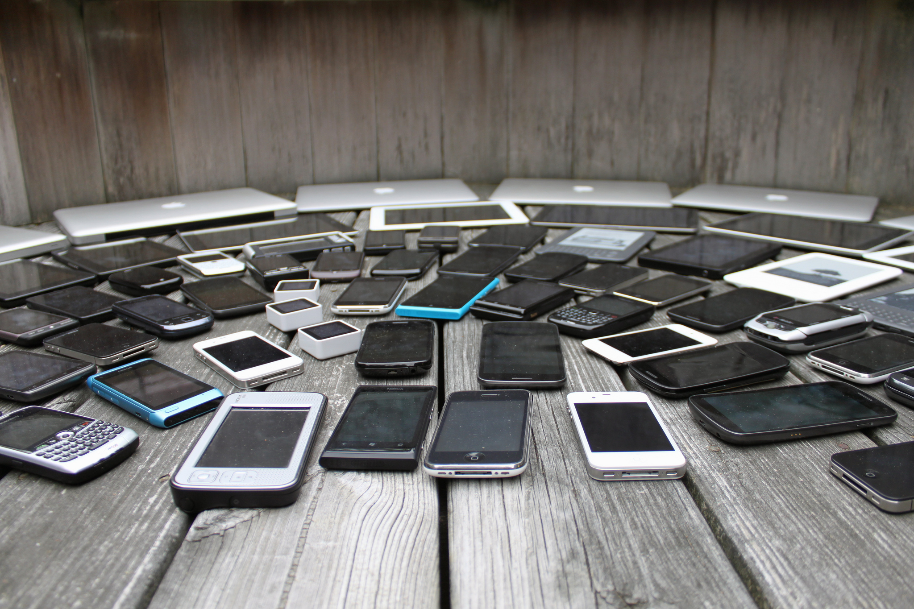
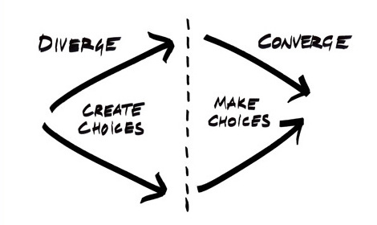

# FF UX :fire:

^ How many do you give about your users?

---

### Goals for the day

## Identify your specific **Problems** and **Patterns**

---

### Goals for the day

## Make your own list of Future Friendly UX **Principles**

---

### Goals for the day

## Start sketching out **Solutions**

---

### Agenda

## Breaks at 2pm, 3pm, 4pm

---

# Problems

^ The assumptions we make that date, sometimes very quickly.
The things we don't know.

---

# Patterns

^ The patterns that show these assumptions.

---

# Principles

^ Principles we can follow to avoid the Problems and Patterns.
Not rules: guidelines and suggestions.

---

# Solutions

^ Specific, practical, new Patterns we can use to avoid these Problems.

---

## What is Future Friendly UX design?

^ Being careful about the assumptions we make
Designing for change, unknowns

---

^ Big names in Mobile, Responsive, UX (Luke Wroblewski, Scott Jenson, Brad Frost, Jeremy Keith, Lyza D. Gardner, Scott Jehl, Stephanie Rieger, Josh Clark, ...)
This png is not future friendly :)

---

## futurefriend.ly

^ This is the world now

---

## The **quantity** and **diversity** of connected **devices** is increasing.

---

## The quantity and diversity of connected devices, **and the people that use them**, is increasing.

^ New audiences
Never been connected before
Mobile-only

---

## 1. acknowledge and embrace unpredictability

^ We can deal with this exciting, overwhelming, world by:

---

## 2. think and behave in a future friendly way

---

## 3. help others to do the same.

---

## Future Friendly
## Principles

---

### Future Friendly Principles

# Focus

^ * more people, more channels
* less time, less attention
* relevant, high quality, content, delivered fast

---

### Future Friendly Principles

# Content

^ * it could go anywhere
* start with well-structured HTML
* Progressive Enhancement to layer on presentation
* Progressive Enhancement to layer on behaviour

---

### Future Friendly Principles

# Devices

^ * make some best guesses
* high-level, good-enough, classifications for devices
* play to the strengths and unique capabilities of devices

---

# It's a Mission

^ * long term approach
* guided by principles

---

### Future Friendly UX Design

## An example

^ How we're going to do it today

---

### Problem

## Assumptions about
## user's interest

^ in *all* our stuff

---

### Pattern

## Carousel ಠ_ಠ

^ Probably auto-playing
Probably 5+ slides

---

### Principle

## Focus

---

---

### Solution

## Single hero image
## Random on page load

---

## Questions / queries?
