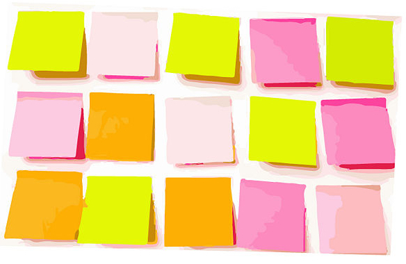

### Write down someone else's answers to the warm-up questions

### (What was the first thing you worked on?)
### (What are you working on now that will need updating soon?)

---

## Write down changes in the tech landscape in the past few years

---

## What's the most important Future Friendly principle?

---

## Walk around and write on the posters

---

## Make a summary of the posters to present to the room

---

## Find a partner at another table
## Tell them about one thing you've learned so far

---

## Identify Problems
## and Patterns
## for your stuff

---

### Problems or Patterns

## Diverge: create choices
## Quantity over Quality

---

### Problems or Patterns

## Converge: make choices
## Dot voting

---

## Your Pattern / Problem: 1 sentence
## Your most-voted Solution: 1 sentence

---

## On the front:
## your SMART goal.
## On the back:
## your details.
## Swap with a buddy.

---

## Feedback

### justin@justinslack.com
### steve@naga.co.za
